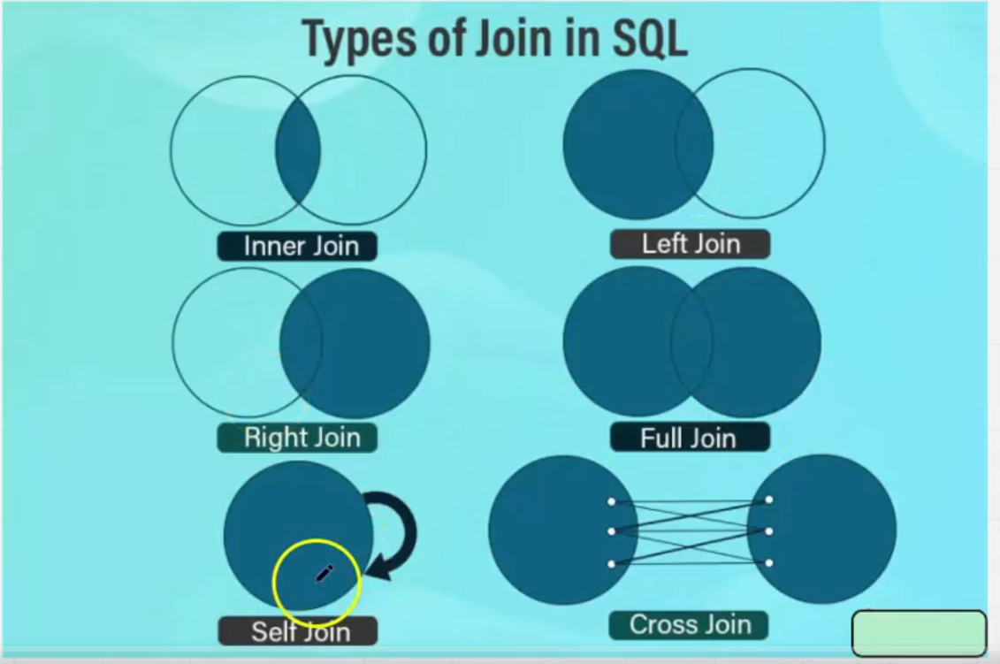

# SQL Commands - Quick Revision Guide for Beginners

## Overview

This guide explains SQL (Structured Query Language) commands used to create, read, update, and delete data in databases. We'll use an organization database with **Employees**, **Departments**, and **Projects** tables. The schema is set up so all three tables can be joined (Employees → Departments ← Projects).

---

## Table of Contents

1. [Database Basics](#1-database-basics)
2. [CREATE TABLE](#2-create-table)
3. [INSERT - Adding Data to Tables](#3-insert---adding-data-to-tables)
4. [SELECT - Reading and Viewing Data](#4-select---reading-and-viewing-data)
5. [WHERE Clause - Filtering Data](#5-where-clause---filtering-data)
6. [ORDER BY - Sorting Data](#6-order-by---sorting-data)
7. [UPDATE - Changing Existing Data](#7-update---changing-existing-data)
8. [DELETE - Removing Rows](#8-delete---removing-rows)
9. [ALTER TABLE - Changing Table Structure](#9-alter-table---changing-table-structure)
10. [Constraints - Adding Rules to Columns](#10-constraints---adding-rules-to-columns)
11. [Inspecting Table Structure](#11-inspecting-table-structure)
12. [RENAME TABLE](#12-rename-table)
13. [DROP TABLE](#13-drop-table)
14. [TRUNCATE TABLE](#14-truncate-table)
15. [Joining All Three Tables (Quick Reference)](#15-joining-all-three-tables-quick-reference)
16. [Retrieving Data in SQL (Section 2)](#16-retrieving-data-in-sql-section-2)
17. [Aggregation Functions](#17-aggregation-functions)
18. [Normalization and Types of Joins](#18-normalization-and-types-of-joins)

---

## 1. Database Basics

### CREATE DATABASE

**Syntax:**
```sql
CREATE DATABASE Database_Name;
```

**Command:**
```sql
CREATE DATABASE orgs;
```

**What it does:** Creates a new database named "orgs" to store tables and data.

---

### USE

**Syntax:**
```sql
USE Database_Name;
```

**Command:**
```sql
USE orgs;
```

**What it does:** Tells SQL to perform all operations on the "orgs" database.

---

## 2. CREATE TABLE

**Syntax:**
```sql
CREATE TABLE Table_Name(
    Column_Name DataType Constraint,
    Column_Name DataType Constraint
);
```

### Departments (create this first)

**Command:**
```sql
CREATE TABLE Departments (
    DepartmentId INT PRIMARY KEY,        -- Unique ID for each department
    DepartmentName VARCHAR(100) UNIQUE    -- Department name, no duplicates
);
```

**What it does:** Creates the Departments table. We create it first so Employees and Projects can reference it.

---

### Employees

**Command:**
```sql
CREATE TABLE Employees (
    EmployeeId INT PRIMARY KEY,           -- Unique ID for each employee
    FirstName VARCHAR(50),                -- Text, max 50 characters
    LastName VARCHAR(50),                 -- Text, max 50 characters
    DepartmentId INT,                     -- Links to Departments table
    Salary DECIMAL(10,2),                 -- Number with 2 decimal places
    HireDate DATE,                        -- Date format (YYYY-MM-DD)
    CONSTRAINT fk_dept FOREIGN KEY (DepartmentId) REFERENCES Departments(DepartmentId)
);
```

**What it does:** Creates the Employees table. DepartmentId links each employee to a department so we can join the tables.

---

### Projects

**Command:**
```sql
CREATE TABLE Projects (
    project_id INT PRIMARY KEY,           -- Unique ID for each project
    project_name VARCHAR(100) NOT NULL,   -- Text, must have a value
    budget DECIMAL(10,2),                 -- Number with 2 decimal places
    start_date DATE,                      -- Date format (YYYY-MM-DD)
    end_date DATE,                        -- Date format (YYYY-MM-DD)
    department_id INT,                    -- Links to Departments table
    CONSTRAINT fk_dept_project FOREIGN KEY (department_id) REFERENCES Departments(DepartmentId)
);
```

**What it does:** Creates the Projects table. department_id links each project to a department so we can join with Departments and Employees.

---

### Data Types Explained

- **INT** — Whole numbers (e.g. 101, 5000)
- **VARCHAR(50)** — Text up to 50 characters
- **DECIMAL(10,2)** — Numbers with decimals (e.g. 50000.00)
- **DATE** — Store dates in YYYY-MM-DD format
- **PRIMARY KEY** — Unique identifier for each row (no duplicates allowed)
- **FOREIGN KEY** — Links this column to a column in another table (for joins)
- **UNIQUE** — No two rows can have the same value in this column
- **NOT NULL** — This column must always have a value

---

## 3. INSERT - Adding Data to Tables

### Single Row Insert

**Syntax:**
```sql
INSERT INTO Table_Name (Column1, Column2, Column3)
VALUES (value1, value2, value3);
```

**Command:**
```sql
INSERT INTO Employees (EmployeeId, FirstName, LastName, DepartmentId, Salary, HireDate)
VALUES (101, 'Sanjeet', 'Kumar', 1, 50000, '2022-07-14');
```

**What it does:** Adds a new row with employee data.

---

### Multiple Rows Insert

**Syntax:**
```sql
INSERT INTO Table_Name (Column1, Column2, Column3)
VALUES 
    (value1, value2, value3),
    (value1, value2, value3),
    (value1, value2, value3);
```

**Command:**
```sql
INSERT INTO Employees (EmployeeId, FirstName, LastName, DepartmentId, Salary, HireDate)
VALUES 
    (102, 'Suresh', 'Kumar', 1, 50000, '2025-01-15'),
    (103, 'Anita', 'Sharma', 2, 42000, '2024-11-20'),
    (104, 'Rahul', 'Verma', 3, 45000, '2023-09-10'),
    (105, 'Priya', 'Singh', 4, 52000, '2022-06-25'),
    (106, 'Amit', 'Patel', 1, 60000, '2021-03-18');
```

**What it does:** Adds multiple rows in a single command (more efficient).

---

## 4. SELECT - Reading and Viewing Data

### SELECT All Columns

**Syntax:**
```sql
SELECT * FROM Table_Name;
```

**Command:**
```sql
SELECT * FROM Employees;
```

**What it does:** Displays all columns and rows from the table.

---

### SELECT Specific Columns

**Syntax:**
```sql
SELECT Column1, Column2, Column3 FROM Table_Name;
```

**Command:**
```sql
SELECT project_id, project_name, budget, start_date FROM Projects;
```

**What it does:** Shows only the columns you need.

---

## 5. WHERE Clause - Filtering Data

**Syntax:**
```sql
SELECT * FROM Table_Name WHERE Condition;
```

**Command:**
```sql
SELECT * FROM Employees WHERE DepartmentId = 1;
```

**What it does:** Filters data to show only rows that match a condition.

### Common Operators Used with WHERE

- `=` (equals)
- `!=` or `<>` (not equals)
- `>` (greater than)
- `<` (less than)
- `>=` (greater than or equal)
- `<=` (less than or equal)

---

## 6. ORDER BY - Sorting Data

**Syntax:**
```sql
SELECT * FROM Table_Name ORDER BY Column_Name ASC|DESC;
```

**Command:**
```sql
SELECT * FROM Employees ORDER BY Salary DESC;
```

**What it does:** Sorts the result. **DESC** = high to low (or Z–A). **ASC** = low to high (or A–Z); it's the default if you don't write ASC or DESC.

---

## 7. UPDATE - Changing Existing Data

**Syntax:**
```sql
UPDATE Table_Name SET Column = Value WHERE Condition;
```

**Command:**
```sql
UPDATE Employees SET LastName = 'Verma' WHERE EmployeeId = 101;
```

**What it does:** Changes existing data. **Always use WHERE** so you don't update every row.

---

## 8. DELETE - Removing Rows

**Syntax:**
```sql
DELETE FROM Table_Name WHERE Condition;
```

**Command:**
```sql
DELETE FROM Employees WHERE EmployeeId = 107;
```

**What it does:** Removes rows that match the condition. If another table has a FOREIGN KEY to this row, the delete may fail; update or delete the child rows first.

---

## 9. ALTER TABLE - Changing Table Structure

### ADD COLUMN

**Syntax:**
```sql
ALTER TABLE Table_Name ADD COLUMN Column_Name DataType;
```

**Command:**
```sql
ALTER TABLE Employees ADD COLUMN Email VARCHAR(100);
```

**What it does:** Adds a new column. Existing rows get NULL (or default) in that column.

---

### MODIFY COLUMN

**Syntax:**
```sql
ALTER TABLE Table_Name MODIFY COLUMN Column_Name NewDataType;
```

**Command:**
```sql
ALTER TABLE Employees MODIFY COLUMN Email VARCHAR(100);
ALTER TABLE Employees MODIFY COLUMN Salary INT;
```

**What it does:** Changes the column's data type or size. Also used to add NOT NULL (e.g. `MODIFY COLUMN FirstName VARCHAR(50) NOT NULL`).

---

### RENAME COLUMN

**Syntax:**
```sql
ALTER TABLE Table_Name RENAME COLUMN Old_Name TO New_Name;
```

**Command:**
```sql
ALTER TABLE Employees RENAME COLUMN PhoneNo TO phone_no;
```

**What it does:** Renames a column (e.g. for naming conventions like snake_case).

---

### DROP COLUMN

**Syntax:**
```sql
ALTER TABLE Table_Name DROP COLUMN Column_Name;
```

**Command:**
```sql
ALTER TABLE Employees DROP COLUMN phone_no;
```

**What it does:** Removes the column and its data from the table.

---

## 10. Constraints - Adding Rules to Columns

### NOT NULL (use MODIFY)

**Syntax:**
```sql
ALTER TABLE Table_Name MODIFY COLUMN Column_Name DataType NOT NULL;
```

**Command:**
```sql
ALTER TABLE Employees MODIFY COLUMN FirstName VARCHAR(50) NOT NULL;
```

**What it does:** Ensures the column always has a value. For NOT NULL we use **MODIFY**, not ADD CONSTRAINT.

---

### UNIQUE (use ADD CONSTRAINT)

**Syntax:**
```sql
ALTER TABLE Table_Name ADD CONSTRAINT Constraint_Name UNIQUE(Column_Name);
```

**Command:**
```sql
ALTER TABLE Employees ADD CONSTRAINT un_email UNIQUE(Email);
```

**What it does:** No two rows can have the same value in that column. We use a constraint name so we can drop it later.

---

### CHECK (add and drop)

**Syntax (add):**
```sql
ALTER TABLE Table_Name ADD CONSTRAINT Constraint_Name CHECK(Condition);
```

**Command (add):**
```sql
ALTER TABLE Employees ADD CONSTRAINT check_salary CHECK(salary <= 500000);
```

**What it does:** Only allows rows where the condition is true.

**Syntax (drop):**
```sql
ALTER TABLE Table_Name DROP CHECK Constraint_Name;
```

**Command (drop):**
```sql
ALTER TABLE Employees DROP CHECK check_salary;
```

**What it does:** Removes the CHECK rule using the constraint name.

---

### FOREIGN KEY (add and drop)

**Syntax (add):**
```sql
ALTER TABLE Table_Name ADD CONSTRAINT Fk_Name FOREIGN KEY (Column) REFERENCES Other_Table(Column);
```

**Command (add):**
```sql
ALTER TABLE Projects ADD CONSTRAINT fk_dept_project FOREIGN KEY (department_id) REFERENCES Departments(DepartmentId);
```

**What it does:** Links this table's column to another table so we can join them.

**Syntax (drop):**
```sql
ALTER TABLE Table_Name DROP FOREIGN KEY Constraint_Name;
```

**Command (drop):**
```sql
ALTER TABLE Projects DROP FOREIGN KEY fk_dept_project;
```

**What it does:** Removes the foreign key link. We use the constraint name we gave when adding it.

---

### Constraint Quick Reference (MySQL)

| Constraint   | How to add                          | How to drop                    |
|-------------|--------------------------------------|--------------------------------|
| NOT NULL    | MODIFY COLUMN ... NOT NULL           | MODIFY COLUMN ... NULL         |
| UNIQUE      | ADD CONSTRAINT name UNIQUE(col)      | DROP INDEX name                |
| CHECK       | ADD CONSTRAINT name CHECK(...)       | DROP CHECK name                |
| FOREIGN KEY | ADD CONSTRAINT name FOREIGN KEY ...  | DROP FOREIGN KEY name          |

We use a **constraint name** so we can drop it later with that name.

---

## 11. Inspecting Table Structure

### DESC

**Syntax:**
```sql
DESC Table_Name;
```

**Command:**
```sql
DESC Employees;
```

**What it does:** Shows columns, data types, keys, and whether NULL is allowed in a simple list.

---

### SHOW CREATE TABLE

**Syntax:**
```sql
SHOW CREATE TABLE Table_Name;
```

**Command:**
```sql
SHOW CREATE TABLE Employees;
```

**What it does:** Shows the full CREATE TABLE statement (with all constraints) so you can see the exact structure.

---

## 12. RENAME TABLE

**Syntax:**
```sql
RENAME TABLE Old_Name TO New_Name;
```

**Command:**
```sql
RENAME TABLE Eployee TO Employees;
```

**What it does:** Renames the whole table (e.g. to fix a typo like Eployee).

---

## 13. DROP TABLE

**Syntax:**
```sql
DROP TABLE Table_Name;
```

**Command:**
```sql
DROP TABLE Departments;
```

**What it does:** Deletes the table and all its data. Structure and data are both gone. If other tables have foreign keys to this table, drop those first or the drop will fail.

---

## 14. TRUNCATE TABLE

**Syntax:**
```sql
TRUNCATE TABLE Table_Name;
```

**Command:**
```sql
TRUNCATE TABLE Departments;
```

**What it does:** Deletes all rows but keeps the table structure (columns, keys). The table is empty after truncate. Faster than DELETE when you want to clear the whole table.

---

## 15. Joining All Three Tables (Quick Reference)

**Employees and their department:**
```sql
SELECT * FROM Employees e
JOIN Departments d ON e.DepartmentId = d.DepartmentId;
```

**Projects and their department:**
```sql
SELECT * FROM Projects p
JOIN Departments d ON p.department_id = d.DepartmentId;
```

**Employees, department, and projects of that department:**
```sql
SELECT e.FirstName, e.LastName, d.DepartmentName, p.project_name
FROM Employees e
JOIN Departments d ON e.DepartmentId = d.DepartmentId
JOIN Projects p ON p.department_id = d.DepartmentId;
```

**What it does:** Because Employees and Projects both link to Departments (DepartmentId and department_id), you can join all three tables through Departments.

---

## 16. Retrieving Data in SQL (Section 2)

This section covers more ways to **retrieve** (read) data: filtering with WHERE, pattern matching with LIKE, sorting with ORDER BY, column aliases with AS, DISTINCT, LIMIT, and logical operators (AND, OR, NOT, BETWEEN, IN).

### Clause execution order

SQL runs the parts of a query in a fixed order:

**SELECT → FROM → WHERE → GROUP BY → HAVING → ORDER BY → LIMIT**

So first it picks the table (FROM), then filters rows (WHERE), then groups (GROUP BY), then filters groups (HAVING), then sorts (ORDER BY), then limits how many rows (LIMIT), and SELECT decides which columns to show. Remembering this order helps you write and debug queries.

---

### SELECT all columns vs specific columns

**Syntax (all columns):**
```sql
SELECT * FROM Table_Name;
```

**Command:**
```sql
SELECT * FROM Employees;
```

**What it does:** Returns every column and every row from the table. The `*` means "all columns."

---

**Syntax (specific columns):**
```sql
SELECT Column1, Column2, Column3 FROM Table_Name;
```

**Command:**
```sql
SELECT EmployeeId, FirstName, LastName FROM Employees;
```

**What it does:** Returns only the columns you list. Use this when you need just a few columns; it keeps the result smaller and clearer.

---

### WHERE with equals and comparison operators

**Syntax:**
```sql
SELECT * FROM Table_Name WHERE Column Operator Value;
```

**Command (text match):**
```sql
SELECT * FROM Employees WHERE Department = 'Finance';
```

**What it does:** Shows only rows where the **Department** column equals 'Finance'. Use single quotes for text.

---

**Command (number comparison):**
```sql
SELECT * FROM Projects WHERE budget <= 200000;
```

**What it does:** Shows only projects whose **budget** is less than or equal to 200000. No quotes around numbers.

**Common operators:** `=`, `<>` or `!=` (not equal), `>`, `<`, `>=`, `<=`

---

### LIKE – pattern matching in text

**Syntax:**
```sql
SELECT * FROM Table_Name WHERE Column LIKE 'pattern';
```

**Command (starts with):**
```sql
SELECT * FROM Employees WHERE LastName LIKE 'V%';
```

**What it does:** `%` means "any characters (or none)." So **'V%'** = "starts with V" (e.g. Verma, Singh).

---

**Command (contains):**
```sql
SELECT * FROM Employees WHERE FirstName LIKE '%a%';
```

**What it does:** **'%a%'** = "has the letter a anywhere" (e.g. Anita, Kavita, Priya).

---

**Command (ends with):**
```sql
SELECT * FROM Employees WHERE FirstName LIKE '%a';
```

**What it does:** **'%a'** = "ends with a" (e.g. Priya, Neha, Kavita).

---

### ORDER BY – sorting results

**Syntax:**
```sql
SELECT columns FROM Table_Name ORDER BY Column1 [ASC|DESC], Column2 [ASC|DESC];
```

**Command (single column, newest first):**
```sql
SELECT * FROM Employees ORDER BY HireDate DESC;
```

**What it does:** Sorts by **HireDate**. **DESC** = descending (newest first). **ASC** = ascending (oldest first); ASC is the default.

---

**Command (single column, A–Z):**
```sql
SELECT * FROM Departments ORDER BY DepartmentName;
```

**What it does:** Sorts by **DepartmentName** in ascending order (A–Z) because no ASC/DESC is given.

---

**Command (multiple columns):**
```sql
SELECT DepartmentId, DepartmentName FROM Departments ORDER BY DepartmentId, DepartmentName;
```

**What it does:** Sorts **first by DepartmentId**, then by **DepartmentName** when DepartmentId is the same. The **first column in ORDER BY has priority**.

---

**Command (first column DESC, second ASC):**
```sql
SELECT DepartmentId, DepartmentName FROM Departments ORDER BY DepartmentId DESC, DepartmentName;
```

**What it does:** Sorts by DepartmentId high to low, and within the same DepartmentId sorts by DepartmentName A–Z.

---

### AS – giving columns a different name (alias)

**Syntax:**
```sql
SELECT Column1 AS Alias1, Column2 AS Alias2 FROM Table_Name;
```

**Command:**
```sql
SELECT DepartmentId AS DeptId, DepartmentName AS DeptName FROM Departments;
```

**What it does:** In the result, the column headers show **DeptId** and **DeptName** instead of the original names. Useful for shorter or clearer labels.

---

**Command (alias with spaces – use quotes):**
```sql
SELECT EmployeeId, FirstName, LastName, HireDate AS 'Joining Date' FROM Employees;
```

**What it does:** The last column appears as **Joining Date** in the result. Use single quotes when the alias has spaces or special characters.

---

### Concatenation – combining columns (e.g. full name)

**Syntax (using ||):**
```sql
SELECT Column1 || ' ' || Column2 AS 'Alias' FROM Table_Name;
```

**Command:**
```sql
SELECT EmployeeId, FirstName || ' ' || LastName AS 'Full Name', HireDate AS 'Joining Date' FROM Employees;
```

**What it does:** **||** joins text. Here we combine FirstName, a space, and LastName into one column called **Full Name**. (In MySQL use CONCAT instead of ||; see below.)

---

**Syntax (using CONCAT – MySQL):**
```sql
SELECT CONCAT(Column1, ' ', Column2) AS 'Alias' FROM Table_Name;
```

**Command:**
```sql
SELECT
    EmployeeId,
    CONCAT(FirstName, ' ', LastName) AS 'Full Name',
    HireDate AS 'Joining Date'
FROM Employees;
```

**What it does:** **CONCAT** takes two or more values and joins them. Same idea as || but this form works in MySQL. Result: one column with values like "Sanjeet Kumar."

---

### DISTINCT – unique values only

**Syntax:**
```sql
SELECT DISTINCT Column_Name FROM Table_Name;
```

**Command:**
```sql
SELECT DISTINCT Department FROM Employees;
```

**What it does:** Returns each **different** value of **Department** once (e.g. Engineering, HR, Marketing). Duplicates are removed. Use it when you only care about "what values exist," not how many rows.

---

### LIMIT – cap the number of rows

**Syntax:**
```sql
SELECT * FROM Table_Name LIMIT number;
```

**Command:**
```sql
SELECT * FROM Employees LIMIT 5;
```

**What it does:** Returns only the **first 5 rows**. LIMIT is useful on big tables when you want a quick sample. **LIMIT** is usually written at the end of the query (after ORDER BY if present).

---

### Expressions in SELECT (e.g. days worked)

**Syntax:**
```sql
SELECT Column1, Expression AS 'Alias' FROM Table_Name;
```

**Command:**
```sql
SELECT
    EmployeeId,
    FirstName,
    LastName,
    Department,
    CURRENT_DATE - HireDate AS DaysWorked
FROM Employees;
```

**What it does:** You can use an **expression** (like a calculation) in SELECT. Here we get the difference between today and **HireDate** and show it as **DaysWorked**. (Exact function for "days" may vary: e.g. **DATEDIFF(CURDATE(), HireDate)** in MySQL.)

---

### Logical operators – AND, OR, NOT

**AND – both conditions must be true**

**Syntax:**
```sql
SELECT * FROM Table_Name WHERE Condition1 AND Condition2;
```

**Command:**
```sql
SELECT * FROM Employees WHERE Department = 'HR' AND Salary <= 50000;
```

**What it does:** Returns only rows where **Department** is 'HR' **and** **Salary** is 50,000 or less. Both conditions must be true.

---

**OR – at least one condition must be true**

**Syntax:**
```sql
SELECT * FROM Table_Name WHERE Condition1 OR Condition2;
```

**Command:**
```sql
SELECT * FROM Projects WHERE Budget > 100000 OR start_date <= '2023-08-15';
```

**What it does:** Returns rows where **either** budget is over 100,000 **or** start_date is on or before 2023-08-15 (or both).

---

**NOT – condition must be false**

**Syntax:**
```sql
SELECT * FROM Table_Name WHERE NOT Condition;
```

**Command:**
```sql
SELECT * FROM Departments WHERE NOT DepartmentName = 'Marketing';
```

**What it does:** Returns all departments **except** the one named 'Marketing'. Same idea as `WHERE DepartmentName <> 'Marketing'`.

---

### BETWEEN – range of values

**Syntax:**
```sql
SELECT * FROM Table_Name WHERE Column BETWEEN Value1 AND Value2;
```

**Command (dates):**
```sql
SELECT * FROM Employees WHERE HireDate BETWEEN '2022-01-08' AND '2023-03-22';
```

**What it does:** Returns rows where **HireDate** is **within** that date range (including both start and end dates). Use quotes for dates.

---

**Command (numbers):**
```sql
SELECT * FROM Employees WHERE Salary BETWEEN 45000 AND 58000;
```

**What it does:** Returns employees whose **Salary** is between 45,000 and 58,000 (both numbers included). No quotes for numbers.

**Operators quick list:** `>`, `<`, `>=`, `<=`, `<>`, `=`, **LIKE**, **NOT**, **AND**, **OR**, **BETWEEN ... AND**

---

### IN – match any value in a list

**Syntax:**
```sql
SELECT * FROM Table_Name WHERE Column IN (value1, value2, value3);
```

**Command:**
```sql
SELECT * FROM Employees WHERE EmployeeId IN (101, 104, 108, 110);
```

**What it does:** Returns only rows where **EmployeeId** is **one of** 101, 104, 108, or 110. Shorthand for `WHERE EmployeeId = 101 OR EmployeeId = 104 OR EmployeeId = 108 OR EmployeeId = 110`. Handy when you have several allowed values.

---

## 17. Aggregation Functions

**Aggregation functions** work on many rows and return a single value (e.g. total count, sum, average, max, min). They are often used with **GROUP BY** (to get one result per group) and **HAVING** (to filter those groups).

---

### COUNT() – count rows

**Syntax:**
```sql
SELECT COUNT(*) AS 'Alias' FROM Table_Name;
```

**Command:**
```sql
SELECT COUNT(*) AS 'Total Count' FROM Employees;
```

**What it does:** Returns **how many rows** are in the table. `COUNT(*)` counts every row. You can also use `COUNT(Column_Name)` to count only rows where that column is not NULL.

---

### SUM() – add up values

**Syntax:**
```sql
SELECT SUM(Column_Name) AS 'Alias' FROM Table_Name;
```

**Command:**
```sql
SELECT SUM(Salary) AS 'Total Salary' FROM Employees;
```

**What it does:** Adds up all values in the **Salary** column and returns one number (total payroll). Use SUM for numeric columns.

---

### AVG() – average value

**Syntax:**
```sql
SELECT AVG(Column_Name) AS 'Alias' FROM Table_Name;
```

**Command:**
```sql
SELECT AVG(Salary) AS 'AVG Salary' FROM Employees;
```

**What it does:** Returns the **average** of all values in **Salary** (sum of salaries ÷ number of rows). NULL values are ignored in the calculation.

---

### MAX() – largest value

**Syntax:**
```sql
SELECT MAX(Column_Name) AS 'Alias' FROM Table_Name;
```

**Command:**
```sql
SELECT MAX(Salary) AS 'Max Salary' FROM Employees;
```

**What it does:** Returns the **highest** value in the **Salary** column. Works for numbers and for text (e.g. last name alphabetically).

---

### MIN() – smallest value

**Syntax:**
```sql
SELECT MIN(Column_Name) AS 'Alias' FROM Table_Name;
```

**Command:**
```sql
SELECT MIN(Salary) AS 'Min Salary' FROM Employees;
```

**What it does:** Returns the **lowest** value in the **Salary** column. Works for numbers and for text.

---

### GROUP BY – one result per group

When you use an aggregation function (SUM, COUNT, etc.) with **GROUP BY**, SQL splits the rows into **groups** (by the column(s) you choose) and then applies the function **to each group**. So you get one row per group instead of one row for the whole table.

**Syntax:**
```sql
SELECT Column_Group, Aggregation_Function(Column) AS 'Alias'
FROM Table_Name
GROUP BY Column_Group;
```

**Command (total salary per department):**
```sql
SELECT 
    Department, 
    SUM(Salary) AS 'Total Salary' 
FROM Employees 
GROUP BY Department;
```

**What it does:** Groups rows by **Department**, then sums **Salary** for each department. Result: one row per department with that department’s total salary.

---

**Command (group by multiple columns):**
```sql
SELECT 
    EmployeeId,
    FirstName,
    LastName,
    Department, 
    SUM(Salary) AS 'Total Salary' 
FROM Employees 
GROUP BY EmployeeId, FirstName, LastName, Department;
```

**What it does:** Groups by **EmployeeId, FirstName, LastName, Department**. Here each employee is their own “group,” so SUM(Salary) is just that employee’s salary. Useful when you want to show these columns together with an aggregate; every column in SELECT that is not inside an aggregate should usually be in GROUP BY.

---

**Command (count per department):**
```sql
SELECT Department, COUNT(*) AS 'Total Employee' FROM Employees GROUP BY Department;
```

**What it does:** For each **Department**, counts how many employees there are. Result: one row per department with its employee count.

---

**Command (average, max per department):**
```sql
SELECT Department, AVG(Salary) FROM Employees GROUP BY Department;
SELECT Department, MAX(Salary) FROM Employees GROUP BY Department;
SELECT Department, MIN(Salary) FROM Employees GROUP BY Department;
```

**What it does:** Same idea as above: **GROUP BY Department** gives one row per department, and AVG/MAX/MIN give the average, highest, or lowest salary in that department.

---

### HAVING – filter groups (after aggregation)

**WHERE** filters **rows** before grouping. **HAVING** filters **groups** after grouping. So you use HAVING when the condition is on an **aggregate** (e.g. “only departments with more than 2 employees”) or on the grouped column.

**Syntax:**
```sql
SELECT Column_Group, Aggregation_Function(Column) AS Alias
FROM Table_Name
GROUP BY Column_Group
HAVING condition;
```

**Command (only one department):**
```sql
SELECT Department, MIN(Salary) FROM Employees GROUP BY Department HAVING Department = 'HR';
```

**What it does:** Groups by **Department**, then keeps only the group where **Department** is 'HR'. So you see the minimum salary in the HR department only. (You could do similar with WHERE Department = 'HR' and no GROUP BY if you only want one department; HAVING is more useful when the condition is on the aggregate.)

---

**Command (only groups with count > 2):**
```sql
SELECT 
    Department, 
    COUNT(*) AS total_count 
FROM Employees 
GROUP BY Department 
HAVING total_count > 2
ORDER BY total_count;
```

**What it does:** For each **Department**, counts employees (**total_count**). **HAVING total_count > 2** keeps only departments with **more than 2 employees**. **ORDER BY total_count** sorts those departments by count (low to high). So you see “departments that have more than 2 employees,” sorted by how many they have.

**Quick rule:** **WHERE** = filter rows before grouping. **HAVING** = filter groups after grouping (often using COUNT, SUM, AVG, MAX, MIN).

---

## 18. Normalization and Types of Joins

To join tables in a clear and correct way, your data should be in **normalized form**. This section explains what normalization is (with an example), then describes the main **types of joins** with syntax and examples.

---

### What is normalization?

**Normalization** means organizing data so that:

- Each column holds **one** kind of information (no lists or repeated values stuffed in one cell).
- Repeated data is stored in separate tables and linked by IDs (e.g. foreign keys).
- Tables are in a form that makes **joining** and querying simple and consistent.

**Before normalization (not ideal):**

| id | name  | subjects                    |
|----|-------|-----------------------------|
| 1  | Sanju | Math, Science, Chemistry   |
| 2  | Radha | Math, Science, Account     |

Here **subjects** is a single column with many values in one cell. That makes it hard to filter (“give me all students who have Math”) or join with a Subjects table.

**After normalization (better):**

Split into tables so each “fact” is in one place. For example:

**Customer table:**

| id | Name  | Sub1 | Sub2   | Sub3     |
|----|-------|------|--------|----------|
| 1  | Sanju | Math | Science| Chemistry|
| 2  | Radha | Math | Science| Account  |

Or even better: a **Customer** table (id, Name) and a **Customer_Subjects** table (CustomerId, Subject) with one row per subject. Then you can join and filter easily.

**Why it matters for joins:** When data is normalized, each table has a clear role and you link them with keys (e.g. DepartmentId, EmpId). Joins then “match” rows on those keys and give you the combined result you expect. If data is not normalized (e.g. comma‑separated values in one column), joining is messy or not possible in a standard way.

---

### Types of joins – overview

The diagram below shows the six common join types. Each join decides **which rows** from the two tables appear in the result.



*Place the image file **Types-of-Join-SQL.png** in the same folder as this file so the diagram appears here. It shows: Inner Join (overlap only), Left Join (left + overlap), Right Join (right + overlap), Full Join (both circles), Self Join (one table with itself), Cross Join (every row with every row).*

---

### 1. Inner Join

**Meaning:** Only rows that have a **match in both tables** are returned. In the Venn diagram, only the **overlapping** part of the two circles.

**Syntax:**
```sql
SELECT columns
FROM Table1 AS alias1
INNER JOIN Table2 AS alias2 ON alias1.CommonColumn = alias2.CommonColumn;
```

**Why use aliases:** Both tables might have columns with the same name (e.g. Id, Name). Using **AS e** and **AS d** (or just **e** and **d**) lets you write **e.EmployeeId** and **d.DepartmentId** so the database knows which table’s column you mean.

**Command:**
```sql
SELECT e.EmployeeId, e.FirstName, e.LastName, e.Salary, d.DepartmentName, d.DepartmentId
FROM Employees AS e
INNER JOIN Departments d ON e.EmployeeId = d.EmpId;
```

**What it does:** Joins **Employees** (e) and **Departments** (d) where **e.EmployeeId = d.EmpId**. Only employees who appear in **Departments** as **EmpId** (and only departments that have a matching employee) are in the result. You get one row per match with employee and department columns.

**Example idea:**

| Employees (e)     | Departments (d)   | Result (e + d where e.EmployeeId = d.EmpId) |
|-------------------|-------------------|--------------------------------------------|
| 101, Sanjeet, …   | EmpId=102, Eng…   | (no match for 101)                          |
| 102, Suresh, …    | EmpId=102, Eng…   | 102, Suresh, …, Engineering, 2              |

Only matching rows appear.

---

### 2. Left Join (LEFT OUTER JOIN)

**Meaning:** **All rows from the left table** (first table) plus **matching rows** from the right table. If there is no match, the right table’s columns show **NULL**.

**Syntax:**
```sql
SELECT columns
FROM Table1 AS alias1
LEFT JOIN Table2 AS alias2 ON alias1.CommonColumn = alias2.CommonColumn;
```

**Command:**
```sql
SELECT e.EmployeeId, e.FirstName, e.LastName, d.DepartmentName
FROM Employees e
LEFT JOIN Departments d ON e.EmployeeId = d.EmpId;
```

**What it does:** Every **employee** row is in the result. If that employee’s **EmployeeId** appears as **EmpId** in **Departments**, you see the department name; otherwise **DepartmentName** is NULL.

---

### 3. Right Join (RIGHT OUTER JOIN)

**Meaning:** **All rows from the right table** plus **matching rows** from the left table. If there is no match, the left table’s columns show **NULL**.

**Syntax:**
```sql
SELECT columns
FROM Table1 AS alias1
RIGHT JOIN Table2 AS alias2 ON alias1.CommonColumn = alias2.CommonColumn;
```

**Command:**
```sql
SELECT e.EmployeeId, e.FirstName, d.DepartmentId, d.DepartmentName
FROM Employees e
RIGHT JOIN Departments d ON e.EmployeeId = d.EmpId;
```

**What it does:** Every **department** row is in the result. If some **EmpId** in **Departments** matches an **EmployeeId**, you see that employee’s data; otherwise employee columns are NULL.

---

### 4. Full Join (FULL OUTER JOIN)

**Meaning:** All rows from **both** tables. Where they match, you see both sides; where they don’t match, the other table’s columns are **NULL**. (Not supported in MySQL; you can simulate with LEFT + UNION + RIGHT.)

**Syntax:**
```sql
SELECT columns
FROM Table1 AS alias1
FULL OUTER JOIN Table2 AS alias2 ON alias1.CommonColumn = alias2.CommonColumn;
```

**What it does:** Result = left table + right table + overlap. Unmatched rows from either side still appear with NULLs on the other side.

---

### 5. Self Join

**Meaning:** A table is joined **with itself**. You use two aliases for the same table and join on a column that links rows (e.g. ManagerId = EmployeeId).

**Syntax:**
```sql
SELECT alias1.Column, alias2.Column
FROM TableName AS alias1
JOIN TableName AS alias2 ON alias1.LinkColumn = alias2.OtherColumn;
```

**Example idea (employees and their manager):**
```sql
SELECT e1.FirstName AS Employee, e2.FirstName AS Manager
FROM Employees e1
JOIN Employees e2 ON e1.ManagerId = e2.EmployeeId;
```

**What it does:** Each row from the table (e1) is matched with another row from the same table (e2) using the join condition. Useful for hierarchies (e.g. who reports to whom).

---

### 6. Cross Join

**Meaning:** **Every row** in the first table is combined with **every row** in the second table (Cartesian product). No ON condition. Result size = (rows in table1) × (rows in table2).

**Syntax:**
```sql
SELECT columns
FROM Table1
CROSS JOIN Table2;
```

**Command:**
```sql
SELECT e.FirstName, d.DepartmentName
FROM Employees e
CROSS JOIN Departments d;
```

**What it does:** Each employee is paired with every department. Use only when you really need all combinations (e.g. building a grid of options); otherwise it can produce a very large result.

---

### Quick comparison

| Join type   | What you get                                                                 |
|------------|-------------------------------------------------------------------------------|
| **INNER**  | Only rows that match in **both** tables                                      |
| **LEFT**   | All rows from **left** table + matches from right (NULL if no match)         |
| **RIGHT**  | All rows from **right** table + matches from left (NULL if no match)          |
| **FULL**   | All rows from **both** tables (NULL where no match) — not in MySQL            |
| **SELF**   | Same table joined with itself (two aliases)                                   |
| **CROSS**  | Every row of one table with every row of the other (no ON condition)          |
